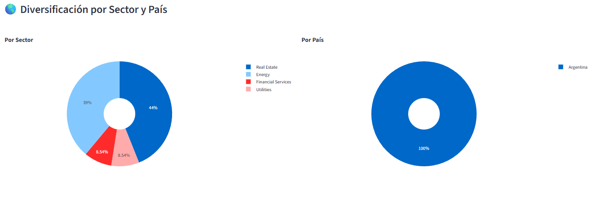

# 📈 Simulador de Portafolio – Argentina  

Simulador interactivo de portafolios pensado para **inversores argentinos** y asesores financieros que quieren analizar:

- Rendimiento  
- Riesgo  
- Diversificación  
- Comparación contra benchmarks relevantes (SPY, inflación Argentina)  
- Escenarios probabilísticos (Simulación de Monte Carlo)  

> 🔒 El código del motor del simulador **no está publicado** en este repositorio.  
> Este repo funciona como **“vidriera” (showcase)** del proyecto.

---

## 🖼️ Galería de capturas – Vista general  

Las imágenes que se mencionan acá son ejemplos.  
Se guardan en `assets/img/` con nombres parecidos a los que figuran abajo.

---

## 🧩 Bloque 0 – Dashboard general (visión 360°)

En el dashboard principal se ve, en un solo lugar:

- Curva de capital del portafolio  
- Métricas resumidas  
- Gráficos de diversificación  
- Comparación contra benchmarks  

Está pensado para que el asesor pueda mostrar “la foto completa” al cliente en una sola pantalla.

---

## 🧱 Bloque 1 – Panel de entrada de datos  

Panel donde se definen los **activos, pesos y parámetros de simulación**.

En este bloque se puede:

- Cargar tickers de la cartera  
- Definir pesos / montos de cada activo  
- Ajustar fechas de análisis  
- Seleccionar moneda base y otros parámetros (según versión)  

---

## 💾 Bloque 1.2 – Gestión de portafolios guardados  

El simulador permite:

- **Guardar portafolios** en un archivo interno (`saved_portfolios.json`)  
- Ponerles nombre (ej: “Cartera Conservadora Cliente A”, “Growth USA”, etc.)  
- **Cargar** esas configuraciones con un par de clics  

Esto es ideal para:

- Trabajar con varios clientes  
- Probar diferentes estrategias y escenarios  
- Volver rápido a una cartera que analizaste en el pasado  

---

## 📉 Bloque 2 – Curva de capital y series históricas  

### 2.1 Curva de capital del portafolio  

Muestra:

- Evolución del valor total del portafolio en el tiempo  
- Impacto de la volatilidad  
- Etapas de subas y caídas (drawdowns)  

### 2.2 Evolución de cada activo  

Gráfico con las series de precios normalizadas de cada activo, para ver:

- Cómo se comporta cada activo vs el resto  
- Qué activo aporta más volatilidad  
- Cómo se correlacionan entre sí  

---

## 📊 Bloque 3 – Métricas y análisis de rendimiento  

Tarjetas con las métricas más importantes para explicar la cartera al cliente.  
Entre otras, según versión local:

- **Retorno total**  
- **Retorno anualizado**  
- **Volatilidad anualizada**  
- **Máximo drawdown**  
- **Ratio de Sharpe**  
- **Ratio de Calmar**  

Este bloque está pensado para que el asesor pueda decirle al cliente, de forma clara:

> “Tu cartera rindió X% anual con una volatilidad de Y%,  
> y el peor periodo tuvo una caída máxima de Z%”.

---

## 🧬 Bloque 4 – Diversificación  

### 4.1 Diversificación por activo  

Gráfico tipo torta o barras que muestra el peso porcentual de cada activo.  
Permite ver:

- Si la cartera está demasiado concentrada en pocas posiciones  
- Si hay concentración excesiva en un solo ticker  

### 4.2 Diversificación por sector  

Gráfico que muestra qué sectores están presentes en la cartera:

- Se filtran y muestran **solo los sectores relevantes** (no “Otros” genéricos)  
- Ayuda a responder: “¿Estamos muy expuestos a consumo / financiero / energía / tech?”  

---

## 🎲 Bloque 5 – Escenarios probabilísticos (Monte Carlo)  

> *Opcional – según versión del simulador*

En este bloque se simulan cientos o miles de trayectorias posibles del portafolio para estimar:

- Distribución de resultados futuros  
- Probabilidad de alcanzar ciertos niveles de capital  
- Escenarios de stress (caídas fuertes)  

Es una forma más profesional de hablar de **riesgo**, especialmente útil para clientes de alto patrimonio o perfiles cuantitativos.

---

## ⚙️ Bloque 6 – Detalles técnicos  

Algunos puntos que se tienen en cuenta en el diseño del simulador:

- Uso de datos históricos de precios ajustados  
- Cálculo de retornos diarios y métricas anualizadas  
- Benchmark principal: **SPY (S&P 500)**  
- Benchmark local: **Inflación Argentina (IPC)**  
- Manejo de pesos por activo y normalización de series  

---

## 👤 Sobre el autor  

Proyecto desarrollado por **Agustín Armada**,  
asesor financiero y entusiasta de las finanzas cuantitativas.

---

## 📩 Contacto / colaboración  

Si te interesa:

- Probar el simulador  
- Usarlo para presentar carteras a tus clientes  
- O explorar una versión a medida para tu estudio / empresa  

podés contactarme por LinkedIn:  
**[Agustín Armada](https://www.linkedin.com/in/agustinarmada/)**  
o por mensaje directo en las redes donde veas este proyecto.
