# 📈 Simulador de Portafolio – Argentina  

Simulador interactivo de portafolios pensado para **inversores argentinos** y **asesores financieros** que quieren analizar:

- Rendimiento (total y anualizado)  
- Riesgo (volatilidad, drawdown, ratios)  
- Diversificación por activo, sector y país  
- Comparación contra benchmarks relevantes (SPY, dólar, inflación Argentina)  
- Escenarios probabilísticos (Simulación de Monte Carlo)  

> 🧠 **Importante:** El código del motor del simulador **no está publicado** en este repositorio.  
> Este repo funciona como **“vidriera” (showcase)** del proyecto: acá solo se ven capturas y explicación funcional.

---

## 🧾 Contenido del repositorio

En este repo vas a encontrar:

- `README.md` → descripción funcional del simulador (este archivo).  
- Carpeta `assets/img/` → **capturas de pantalla** de las distintas secciones de la app:
  - Pantalla inicial / entrada de datos
  - Curva de capital
  - Métricas clave
  - Diversificación por activo / sector / país
  - Alpha y Beta vs benchmark
  - Comparación con SPY, dólar e inflación
  - Simulación de Monte Carlo
  - Correlaciones entre activos
  - Pruebas de stress
  - Optimización (máximo Sharpe / mínima varianza)
  - Valor en Riesgo (VaR)

---

## 🖥️ Vista general – Pantalla inicial

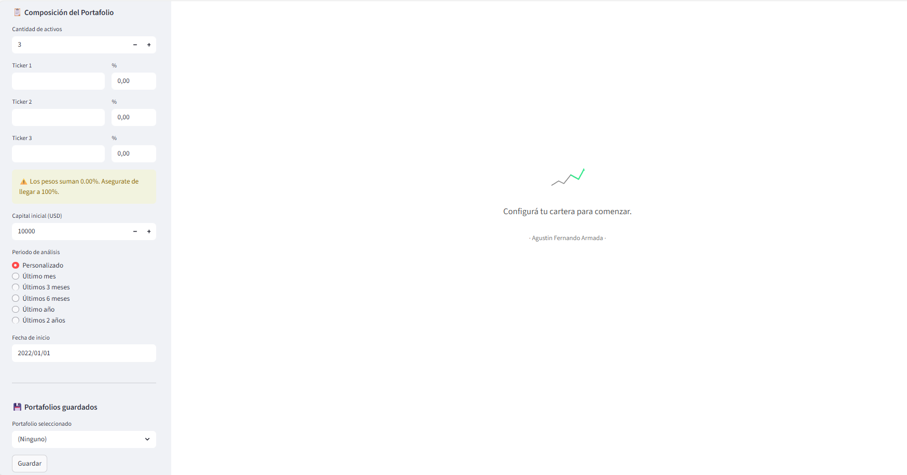

La captura muestra la **pantalla de inicio** del simulador:

- A la izquierda, una **barra de inputs** donde se configuran:
  - Activos / tickers del portafolio  
  - Pesos o montos  
  - Fechas de análisis  
  - Parámetros básicos de la simulación  
- A la derecha, una **zona vacía de espera**, donde luego se irán mostrando:
  - Curva de capital  
  - Métricas  
  - Gráficos de diversificación  
  - Comparación con benchmarks  

Es la pantalla donde el usuario:

- Define el **portafolio inicial**.  
- Ajusta los parámetros antes de correr el análisis.  
- Ve un estado “limpio” antes de cargar datos, ideal para mostrar el flujo de trabajo.

---

## 🧱 Bloque 1 – Definición del portafolio

### 1.1 Panel de entrada de datos  

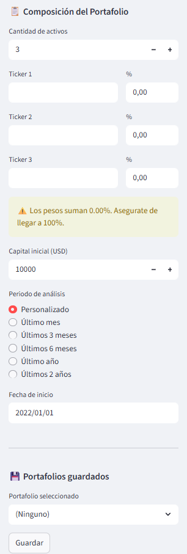

En este bloque se definen los **parámetros base de la simulación**:

- Lista de **activos / tickers**  
- **Weights** asignados a cada activo  
- Fechas de **inicio y fin** del análisis  
- **Moneda base** (ARS o USD, según la lógica de la versión)
- **Valor inicial** de la cartera  
- Benchmark principal a comparar (por ejemplo, **SPY** o un índice local)  

Este panel permite:

- Crear carteras nuevas desde cero  
- Ajustar fechas para “ver qué hubiera pasado si…”  
- Probar el impacto de sacar / agregar activos  
- Cambiar pesos rápidamente y volver a recalcular

---

### 1.2 Gestión de portafolios guardados  

El simulador permite:

- 💾 **Guardar portafolios** en un archivo interno (`saved_portfolios.json`)  
- 🏷️ Asignarles un **nombre** (ej: *“Cartera Conservadora Cliente A”*, *“Growth USA”*)  
- 📂 **Cargar** configuraciones previas con un clic  
- 🧪 Probar diferentes estrategias / escenarios partiendo de carteras ya guardadas  

Esto es ideal para:

- Trabajar con varios clientes  
- Tener **versiones históricas** de una misma cartera  
- Comparar cómo evolucionó un cliente desde que arrancó hasta hoy

---

## 📈 Bloque 2 – Curva de capital y series históricas

### 2.1 Curva de capital del portafolio  

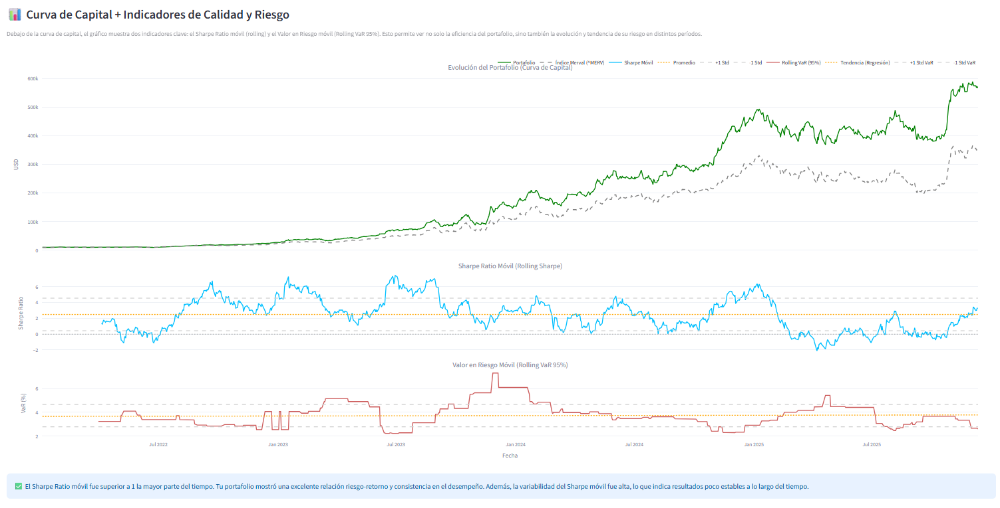

En este bloque se ve la **evolución del valor del portafolio en el tiempo**:

- Crecimiento del capital total  
- Etapas de subas y caídas (**drawdowns**)  
- Posible comparación visual contra un **benchmark** (SPY u otro índice)  

Sirve para responder:

- “¿Cuánto hubiera valido esta cartera si la mantenía estos últimos X años?”  
- “¿Qué tan profundas fueron las caídas máximas?”  
- “¿Cuánto tiempo tardó en recuperarse de un drawdown?”

---

### 2.2 Evolución de cada activo (series normalizadas)

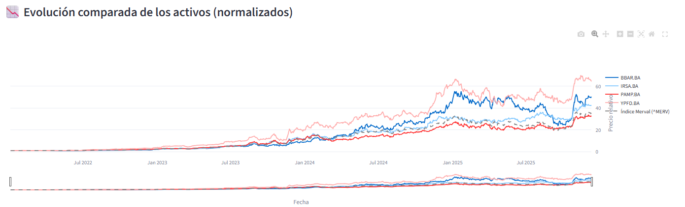

Gráfico con las series de **cada activo** del portafolio, generalmente **normalizadas** para poder compararlas:

- Muestra cómo se comporta cada activo vs el resto.  
- Permite ver **qué activo aporta más volatilidad** o más estabilidad.  
- Ayuda a detectar activos que “se quedaron atrás” o que sobresalieron.

---

## 📊 Bloque 3 – Métricas y análisis cuantitativo

### 3.1 Métricas clave del portafolio

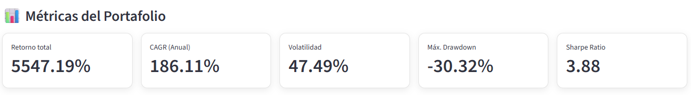

En este bloque se resumen las **métricas principales**, en formato “tarjetas” fáciles de mostrar a un cliente:

Ejemplos de métricas:

- 📈 **Retorno total**  
- 📆 **CAGR anualizado**  
- 🌪️ **Volatilidad anualizada**  
- 📉 **Drawdown máximo**
- ⚖️ **Sharpe Ratio**  

Permite frases tipo:

> “Tu cartera rindió X% anual con una volatilidad de Y%, y el peor período tuvo una caída máxima de Z%.”

---

### 3.2 Alpha y Beta vs benchmark  

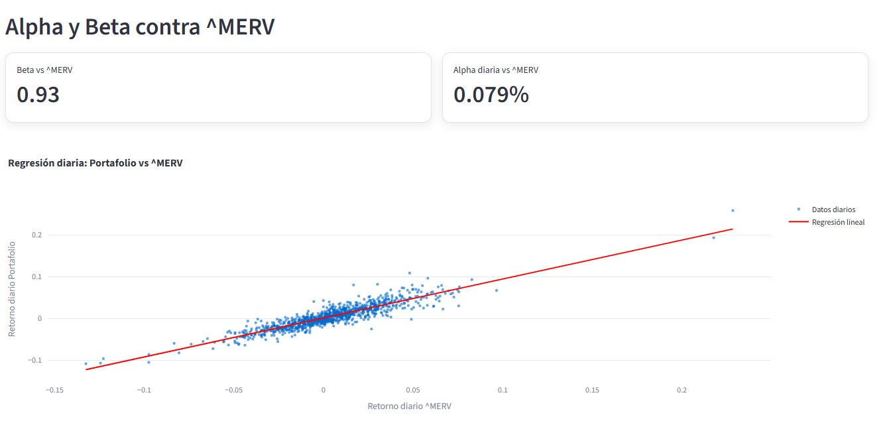

Este bloque muestra los **ratios de referencia frente a un benchmark** (por ejemplo, SPY):

- **Beta** del portafolio → mide cuánto se mueve la cartera respecto al mercado  
- **Alpha** → exceso de rendimiento frente al benchmark, ajustado por el riesgo asumido  

Sirve para responder:

- “¿Estás ganando más o menos que el mercado para el riesgo que tomás?”  
- “¿Tu rendimiento viene de buena selección de activos (alpha) o simplemente de seguir al índice (beta alta)?”  

Es especialmente útil para:

- Asesores cuantitativos  
- Comparar distintas estrategias entre sí  
- Justificar una gestión activa vs pasiva

---

## 🧩 Bloque 4 – Diversificación

### 4.1 Diversificación por activo  

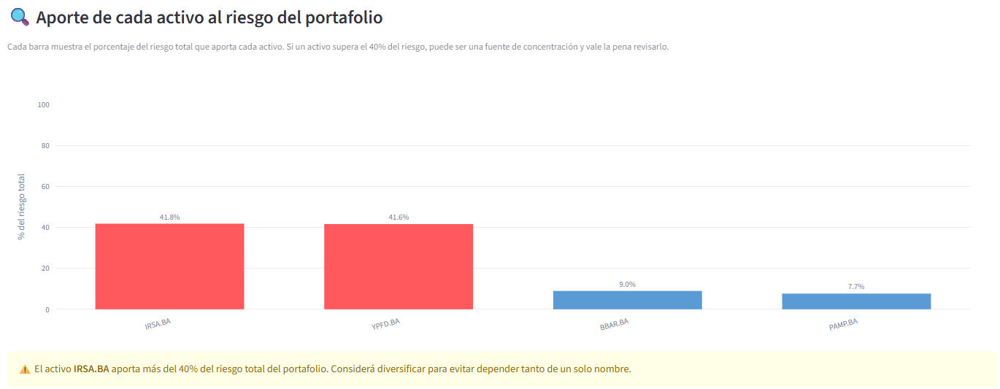

Gráfico de torta o barras mostrando el peso de **cada activo** dentro de la cartera.

Permite ver:

- Si algún activo tiene una concentración **excesiva**  
- Si hay varios activos repartidos de forma más pareja

---

### 4.2 Diversificación por sector y país  

Se agrupan los activos por **sector económico** (tecnología, finanzas, energía, consumo, etc.).

Sirve para:

- Ver si el portafolio está **sobre-expuesto** a un sector (ej: solo tech)  
- Mostrar al cliente un mapa más “macroeconómico” de su cartera  
- Responder:  
  > “Si a tal sector le va mal, ¿cuánto me afecta?”

Además, se puede mostrar la diversificación por **país de origen de la empresa**:

- % en EEUU  
- % en Argentina  
- % en otros mercados  

Ideal para discutir **riesgo geográfico**.

---

## 🧪 Bloque 5 – Benchmarks, dólar e inflación

### 5.1 Comparación contra SPY, dólar e inflación Argentina  

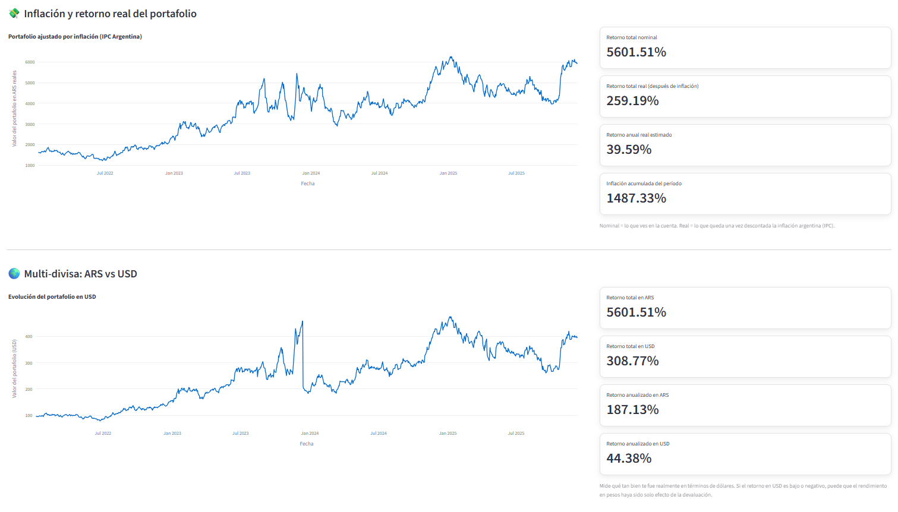

En este bloque se comparan varias curvas a la vez:

- 🟦 **Portafolio**  
- 🟨 **Benchmark global** (por ejemplo, SPY)  
- 🟩 **Inflación Argentina** (IPC) para medir rendimientos **reales**  
- 🟧 **Dólar** (por ejemplo, MEP / CCL / tipo de cambio de referencia definido en la app)  

Responde preguntas muy concretas para el contexto argentino:

- “¿Me hubiese convenido simplemente dolarizarme?”  
- “¿Mi cartera le ganó a la inflación en pesos?”  
- “¿Le gané a quedarme en SPY?”  
- “¿Qué pasa si pienso la rentabilidad en dólares reales y no solo en pesos nominales?”

---

### 5.2 Correlación entre activos  

Matriz o **heatmap de correlaciones** entre los activos del portafolio:

- Permite ver si la cartera está formada por activos que **se mueven todos juntos**.  
- Ayuda a identificar combinaciones que mejoran la **diversificación real**.  

---

### 5.3 Simulación de Monte Carlo  

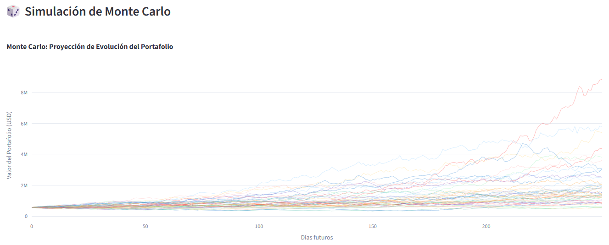

Bloque donde se corre una **Simulación de Monte Carlo** sobre el portafolio:

- Se generan muchos escenarios posibles (ej: 1.000 simulaciones).  
- Se muestra la **distribución de valores futuros** del portafolio.  
- Se pueden marcar:
  - Valor esperado (media)  
  - Desvío estándar  
  - Percentiles (ej: P5, P50, P95)  

Sirve para discutir:

- Rango probable de resultados  
- Riesgo de caer por debajo de un cierto valor objetivo  
- Escenarios optimistas vs pesimistas

---

## 🧨 Bloque 6 – Pruebas de stress

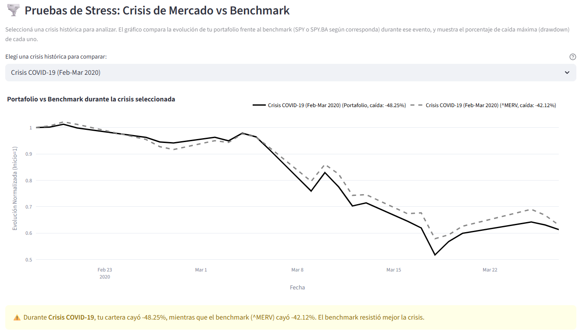

Módulo donde se someten las carteras a **escenarios extremos** para ver su comportamiento:

- Caídas bruscas de mercado (ej: –10%, –20%, –30% en índices clave).  
- Shocks específicos por **sector** o **activo**.  
- Escenarios combinados (suba fuerte del dólar + caída de acciones + inflación alta).  

Permite responder:

- “Si mañana hay una corrección fuerte, ¿cuánto podría caer esta cartera?”  
- “¿Qué parte del portafolio es más frágil ante un stress puntual?”  
- “¿Qué tan robusta es mi estrategia ante escenarios estilo 2008 / 2020?”

Es una herramienta muy útil para:

- Conversaciones de **gestión de riesgo con clientes**.  
- Ajustar pesos antes de un evento clave (elecciones, crisis, etc.).

---

## 🎯 Bloque 7 – Optimización de portafolio  
*(Máximo Sharpe y mínima varianza)*

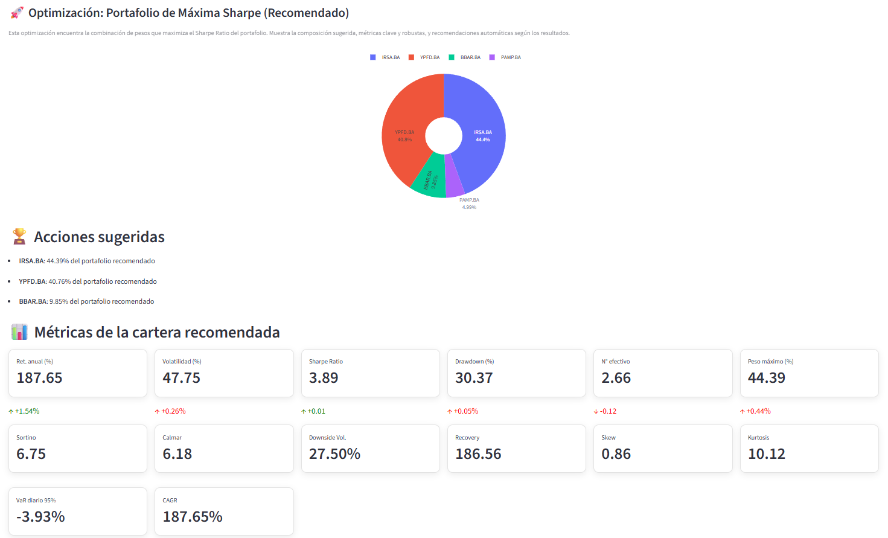
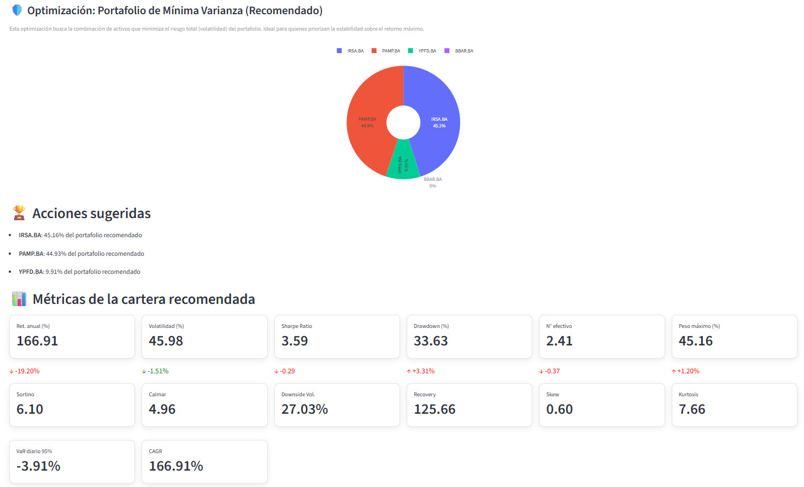

Bloque donde se analizan configuraciones alternativas de cartera para:

- 🔼 **Maximizar el ratio de Sharpe** (más retorno por unidad de riesgo).  
- 🔽 **Minimizar la varianza** (cartera lo más estable posible para un nivel de retorno dado).  

El módulo permite, según versión:

- Definir **restricciones** (por ejemplo: peso máximo por activo, % mínimo en dólares, etc.).  
- Comparar la cartera actual contra:
  - Cartera “Óptima Sharpe”.  
  - Cartera “Mínima varianza”.  
- Ver en gráficos cómo se ubican las distintas alternativas dentro de la **frontera eficiente**.

Sirve para:

- Diseñar propuestas de cartera **más defendibles técnicamente**.  
- Mostrarle al cliente el trade-off riesgo/retorno de forma visual.  
- Justificar cambios en la asignación de activos.

---

## 📉 Bloque 8 – Valor en Riesgo (VaR) diario

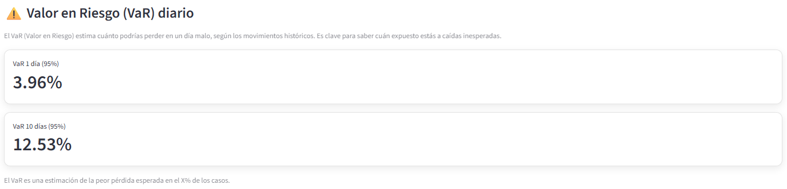

Módulo enfocado en el **riesgo de pérdida en el corto plazo**:

- Cálculo de **Valor en Riesgo (VaR) diario** para la cartera.  
- Posibles metodologías:
  - VaR histórico.  
  - VaR paramétrico (normal).  
  - VaR basado en simulación (Monte Carlo).  

Ejemplos de lectura:

- “Con 95% de confianza, tu pérdida máxima diaria esperada no supera X.”  
- “Con 99% de confianza, el portafolio no debería perder más de Y en un día normal de mercado.”

Ideal para:

- Clientes que preguntan “¿Cuánto puedo llegar a perder en un día malo?”.  
- Integrar métricas de riesgo **tipo banca / institucional** al asesoramiento privado.

---

## 🔍 Tecnologías utilizadas (nivel alto)

Sin entrar en el detalle del código, el simulador está construido con:

- **Python**  
- **Streamlit** para la interfaz  
- **Pandas / NumPy** para manipulación de datos  
- **Librerías financieras / de mercado** para obtener precios históricos  
- **Matplotlib / Plotly** para los gráficos  

---

## ❓ ¿Puedo usar este simulador?

Este repositorio es **solo demostrativo** (showcase).  
El código fuente completo del motor no se publica acá.

Si te interesa:

- Ver una **demo en vivo**,  
- Integrar algo similar en tu proceso de asesoría,  
- O explorar una **adaptación a tu negocio**,

podés contactarme por LinkedIn.

---

## 👤 Autor

**Agustín Armada**  
Operador financiero & desarrollador de herramientas cuantitativas para inversores.

🔗 [LinkedIn – /in/agustinarmada](https://www.linkedin.com/in/agustinarmada/)
